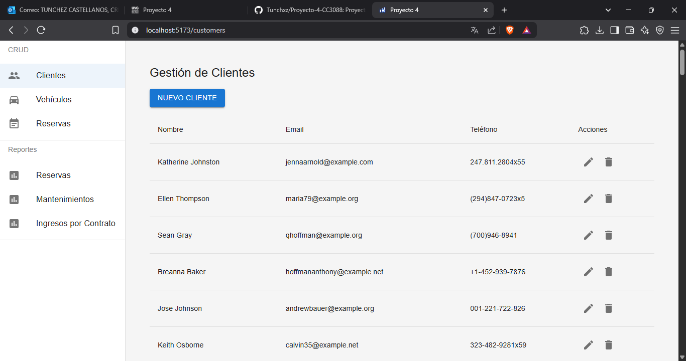
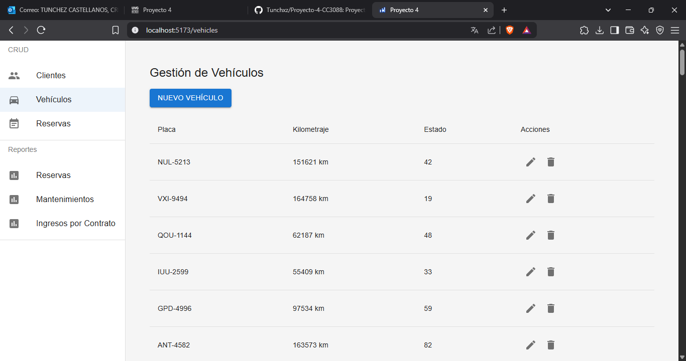
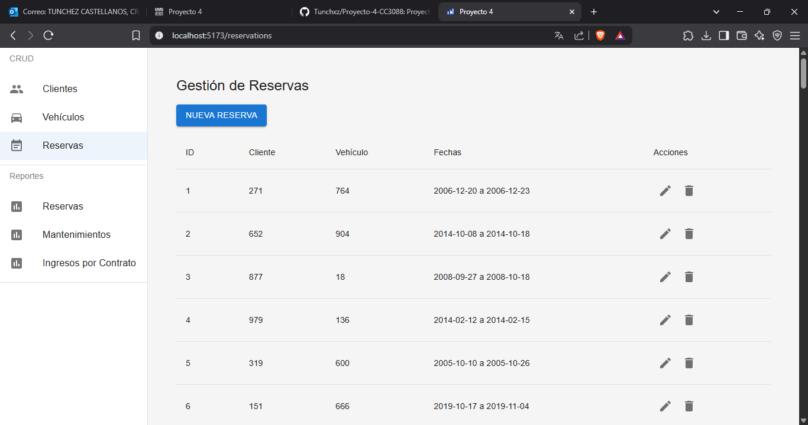
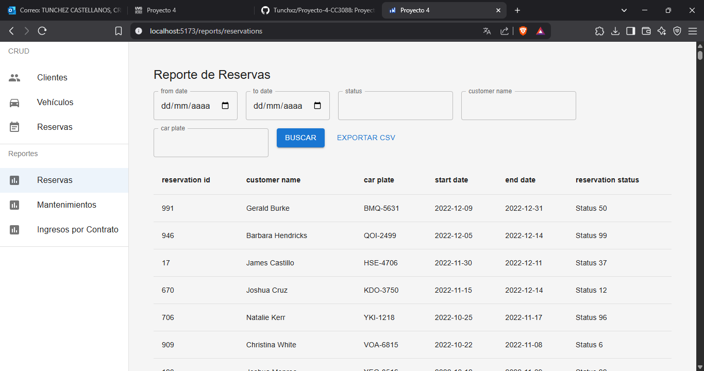
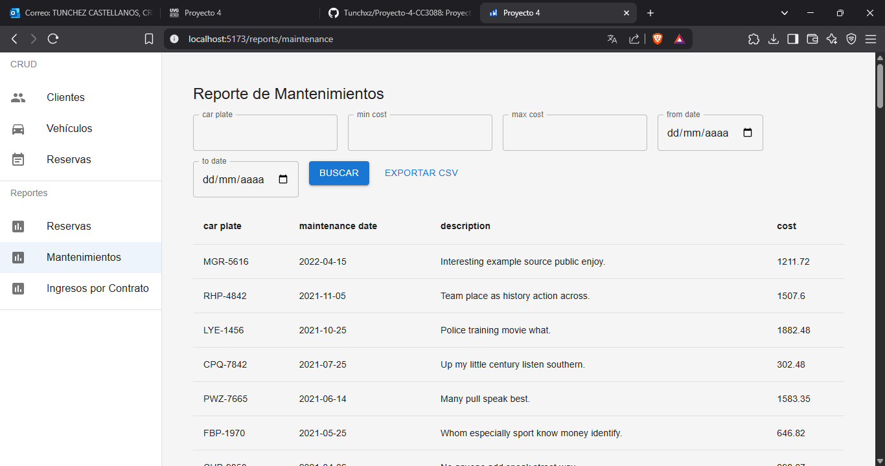
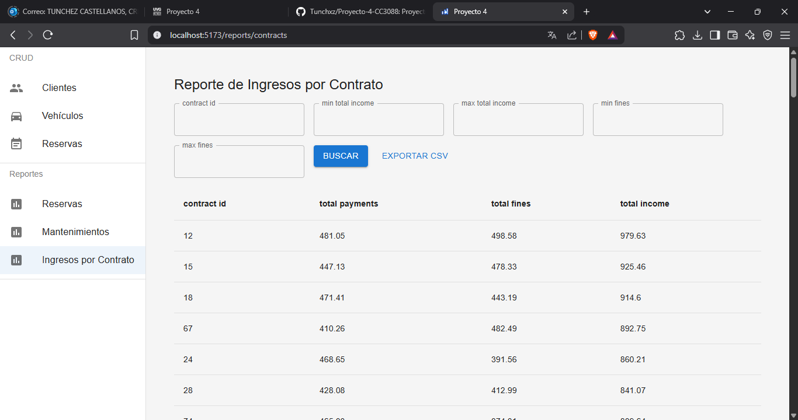
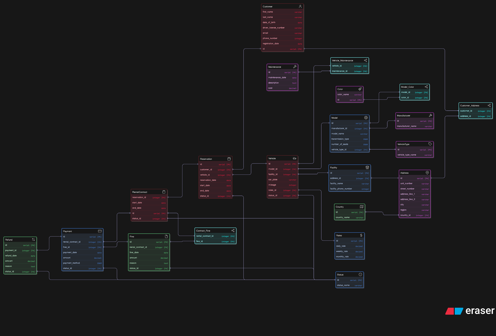

# **Proyecto 4: Sistema de Gestión y Reportería**

Este repositorio corresponde al **Proyecto 4** del curso **Bases de Datos 1 (CC3088)** de la **Universidad del Valle de Guatemala**. El objetivo de esta actividad es diseñar e implementar un sistema completo que incluya modelado de datos, operaciones CRUD, validaciones SQL y generación de reportes, todo ello utilizando un **ORM** como capa de abstracción de acceso a datos.

## **Descripción General**

Durante el desarrollo del proyecto, se construyó una solución integral que simula la gestión de una empresa de alquiler de vehículos. Esta incluye tres módulos CRUD principales (Clientes, Vehículos, Reservas) y tres reportes avanzados con múltiples filtros. Todo el sistema fue implementado usando herramientas modernas de desarrollo web y bases de datos, asegurando coherencia en los datos, validaciones tanto a nivel de aplicación como en la base de datos, y funcionalidades de exportación de datos a CSV.

## **Requerimientos del Proyecto**

A continuación se enlistan los principales requerimientos técnicos y funcionales que cumple este sistema:

### Modelo de Datos
- Al menos **15 tablas normalizadas hasta 3FN**.
- Relaciones **1:N** y **N:M**.
- Mínimo **2 tablas de cruce**.
- Inclusión de **3 tipos de datos personalizados**.
- Diagrama E-R completo con claves y cardinalidades.

### CRUD
- Módulos completos para **Clientes, Vehículos y Reservas**.
- Funcionalidades de **crear, ver, editar y eliminar registros**.
- Uso de **SQL VIEW** como base para las vistas de índice.

### Validaciones y Reglas
- Restricciones: `CHECK`, `NOT NULL`, `UNIQUE`, `DEFAULT`.
- Al menos **3 triggers funcionales**.
- Al menos **2 funciones SQL personalizadas**.
- Validaciones tanto en el frontend como en el backend.

### Vistas SQL
- Al menos **3 vistas (VIEW)** para facilitar la reportería y visualización de datos.

### Datos de Prueba
- Base de datos con **al menos 1000 registros** distribuidos entre las tablas.
- Datos coherentes y variados.

### Reportes (Puntos Extra)
- **Reporte de Reservas** con filtros por cliente, vehículo, fecha, estado y tipo de reserva.
- **Reporte de Mantenimientos** con filtros por tipo de mantenimiento, vehículo, costo, fecha y proveedor.
- **Reporte de Ingresos por Contrato** con filtros por período, monto, cliente, estado y tipo de contrato.
- Cada reporte permite la **exportación a CSV** y presenta los datos de manera clara y organizada.

### Documentación
- Este archivo `README.md`.
- Archivos `schema.sql` y `data.sql`.
- Diagrama ER en formato PDF.

## **Visualización del Proyecto**

A continuación se presentan capturas de las diferentes secciones del sistema implementado:

### CRUDs

**Clientes**  
  

**Vehículos**  
  

**Reservas**  
  

### Reportes

**Reporte de Reservas**  
  

**Reporte de Mantenimientos**  
  

**Reporte de Ingresos por Contrato**  
  

## **Estructura del Proyecto**

```
├── README.md                                    # Documentación principal del proyecto
├── backend                                      # Aplicación del servidor (API)
│   ├── Dockerfile                              # Configuración para containerizar el backend
│   ├── app                                     # Código fuente principal de la aplicación
│   │   ├── __init__.py
│   │   ├── api.py                             # Definición de rutas/endpoints de la API
│   │   ├── controllers/                        # Lógica de control para manejar requests HTTP
│   │   ├── db.py                             # Configuración y conexión a la base de datos
│   │   ├── main.py                           # Punto de entrada principal de la aplicación
│   │   ├── models/                            # Definición de modelos/tablas de la BD
│   │   ├── schemas/                           # Validación y serialización de datos (Pydantic)
│   │   └── services/                          # Lógica de negocio
│   ├── docker-compose.yml                    # Orquestación de containers (backend + BD)
│   ├── requirements.txt                      # Dependencias de Python
│   └── scripts/                               # Scripts SQL para la base de datos
├── docs                                      # Documentación del proyecto
│   └── images/                                # Screenshots y diagramas
└── frontend                                  # Aplicación cliente (React + Vite)
    ├── Dockerfile                            # Configuración para containerizar el frontend
    ├── docker-compose.yml
    ├── eslint.config.js
    ├── index.html
    ├── package-lock.json
    ├── package.json                          # Configuración y dependencias del proyecto
    ├── src                                   # Código fuente de React
    │   ├── App                               # Componente principal y configuración
    │   │   ├── App.jsx
    │   │   ├── layout/
    │   │   ├── main.jsx
    │   │   └── routes.jsx
    │   ├── customers                         # Módulo de gestión de clientes
    │   │   ├── CustomersPage.jsx
    │   │   ├── components/
    │   │   └── hooks/
    │   ├── index.css
    │   ├── reports                           # Módulo de reportes
    │   │   ├── ContractIncomeReport.jsx
    │   │   ├── MaintenanceReport.jsx
    │   │   ├── ReservationReport.jsx
    │   │   └── components/
    │   ├── reservations                      # Módulo de gestión de reservas
    │   │   ├── ReservationsPage.jsx
    │   │   ├── components/
    │   │   └── hooks/
    │   ├── shared                            # Código compartido entre módulos
    │   │   ├── api/
    │   │   └── components/
    │   └── vehicles                          # Módulo de gestión de vehículos
    │       ├── VehiclesPage.jsx
    │       ├── components/
    │       └── hooks/
    └── vite.config.js                        # Configuración de Vite (bundler)
```  

## **Tecnologías Utilizadas**

### Backend
- **Python** con FastAPI
- **SQLAlchemy** - ORM para Python
- **PostgreSQL** - Base de datos relacional
- **Pydantic** - Librería de validación de datos para Python
- **Docker** para containerización

### Frontend
- **React** (framework)
- **JavaScript** (Vanilla)
- **Vite** - Herramienta de build rápida
- **Material UI** - Librería de componentes para React
- **Docker** para containerización

### Infraestructura y DevOps
- **Docker Compose** para orquestación de servicios

## **Cómo Ejecutar el Proyecto**

### **Requisitos Previos**

- [Docker](https://www.docker.com/) y [Docker Compose](https://docs.docker.com/compose/)  
- [Git](https://git-scm.com/)

### **Instalación y Ejecución**

1. **Clonar el repositorio**

   ```bash
   git clone git@github.com:Tunchxz/Proyecto-4-CC3088.git
   ```

2. **Ingresar a la carpeta del proyecto**

   ```bash
   cd Proyecto-4-CC3088
   ```

3. **Levantar los servicios (backend)**

   Desde el directorio raíz del proyecto:  
   ```bash
   cd backend  
   docker-compose up --build
   ```

4. **Levantar los servicios (frontend)**

   Desde el directorio raíz del proyecto:  
   ```bash
   cd frontend  
   docker-compose up --build
   ```

5. **Acceder a la aplicación**

   - **Backend API**: [http://localhost:8000](http://localhost:8000)
   - **Documentación API**: [http://localhost:8000/docs](http://localhost:8000/docs)
   - **Frontend**: [http://localhost:5173](http://localhost:5173)

## **Estructura de la Base de Datos**

**DIAGRAMA ER**  
  

Para una vista más detallada puedes ir a: `docs/images/diagrama-er.png` o [Eraser.io](https://app.eraser.io/workspace/pylC2GEaEMnptbDw9yl4?origin=share). También puedes ver los modelos elaborados con SQLAlchemy en `backend/app/models`.  

## **Comandos Útiles**

```bash
# Ver logs del backend
cd backend && docker-compose logs -f

# Reiniciar servicios
docker-compose restart

# Detener y eliminar contenedores, redes, volúmenes e imágenes creadas
docker-compose down -v

# Acceder a la base de datos
docker-compose exec postgres psql -U admin -d rental_cars_db
```

## **Colaboradores**

- Cristian Túnchez (231359)  
- Dulce Ambrosio (231143)  
- Daniel Chet (231177)  
- Javier Linares (231135)  
- Gadiel Ocaña (231270)
